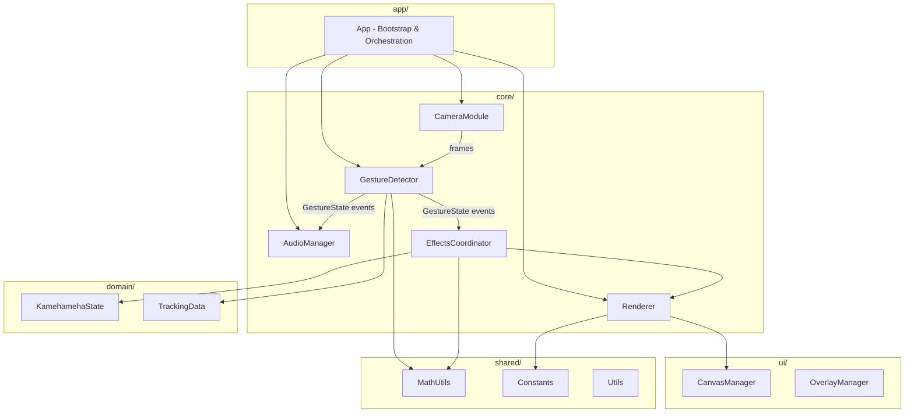
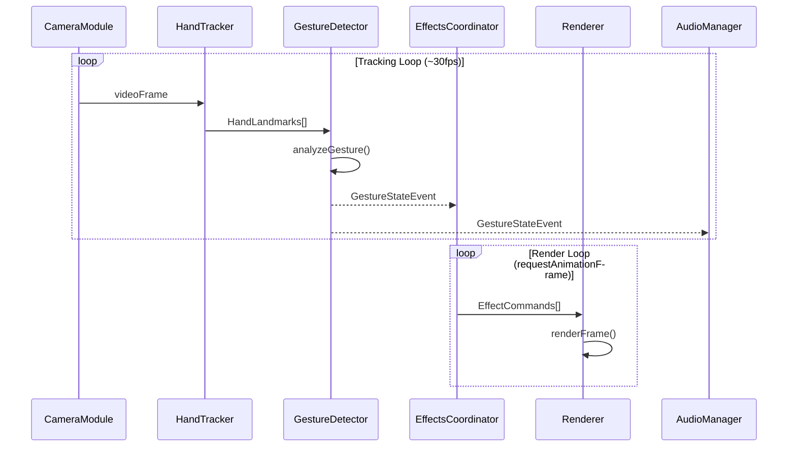
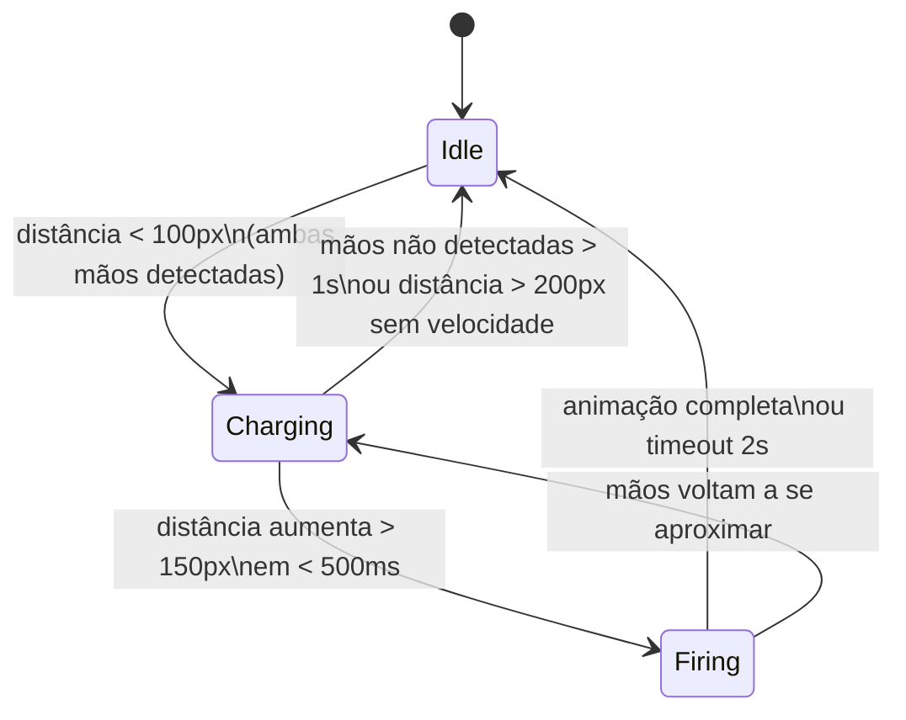

# Documento de Design — Kamehameha Hand Tracking

## Visão Geral

Esta aplicação web de visão computacional em tempo real captura vídeo da webcam, detecta mãos via MediaPipe Hands, reconhece gestos específicos (carregar/disparar) e renderiza efeitos visuais de Kamehameha usando Canvas 2D + Three.js. A arquitetura segue princípios de SDD (Structure-Driven Design) com módulos desacoplados comunicando-se via interfaces e eventos tipados.

O fluxo principal é:
1. **Captura** → CameraModule obtém frames da webcam
2. **Detecção** → HandTracker processa frames com MediaPipe Hands
3. **Análise** → GestureDetector interpreta landmarks e gerencia estados
4. **Renderização** → Pipeline de efeitos visuais (partículas, beam, glow)
5. **Áudio** → AudioManager sincroniza sons com transições de estado

---

## Arquitetura

### Diagrama de Componentes



### Diagrama de Fluxo de Dados



### Decisões Arquiteturais

| Decisão | Escolha | Justificativa |
|---------|---------|---------------|
| Linguagem | TypeScript | Tipagem estática para interfaces entre módulos |
| Hand Tracking | MediaPipe Hands | Solução madura, roda no browser, 21 landmarks por mão |
| Renderização base | Canvas 2D | Composição simples com vídeo, overlays de debug |
| Efeitos 3D | Three.js | Motor de partículas robusto, shaders customizáveis |
| Áudio | Web Audio API | Baixa latência, controle fino de reprodução |
| Comunicação | EventEmitter tipado | Desacoplamento entre módulos, testabilidade |
| Loops separados | Tracking + Render | Tracking pode rodar a 30fps enquanto render roda a 60fps |

---

## Componentes e Interfaces

### CameraModule

Responsável por gerenciar o acesso à webcam e fornecer frames de vídeo.

```typescript
interface ICameraModule {
  initialize(): Promise<void>;
  start(): Promise<void>;
  stop(): void;
  getVideoElement(): HTMLVideoElement;
  getStream(): MediaStream | null;
  isActive(): boolean;
  onError(callback: (error: CameraError) => void): void;
}

type CameraError = 
  | { type: 'permission_denied' }
  | { type: 'no_device' }
  | { type: 'stream_error'; message: string };
```

### HandTracker

Encapsula o MediaPipe Hands e normaliza os dados de landmarks.

```typescript
interface IHandTracker {
  initialize(): Promise<void>;
  processFrame(video: HTMLVideoElement): Promise<HandTrackingResult>;
  setMaxHands(count: 1 | 2): void;
}

interface HandTrackingResult {
  hands: HandData[];
  timestamp: number;
}

interface HandData {
  landmarks: Landmark[];
  handedness: 'left' | 'right';
  confidence: number;
}

interface Landmark {
  x: number; // 0..1 normalizado
  y: number; // 0..1 normalizado
  z: number; // profundidade relativa
}
```

### GestureDetector

Analisa landmarks e gerencia a máquina de estados de gestos.

```typescript
interface IGestureDetector {
  update(trackingResult: HandTrackingResult): void;
  getState(): GestureState;
  getChargeTime(): number;
  onStateChange(callback: (event: GestureStateEvent) => void): void;
}

interface GestureStateEvent {
  previousState: GestureState;
  currentState: GestureState;
  timestamp: number;
  data: GestureEventData;
}

interface GestureEventData {
  handsCenterPosition?: Vec2;
  chargeTime?: number;
  firingDirection?: Vec2;
  separationSpeed?: number;
}

type GestureState = 'idle' | 'charging' | 'firing';
```

### Máquina de Estados do Gesto



### GestureAnalyzer

Módulo utilitário para cálculos de métricas de movimento.

```typescript
interface IGestureAnalyzer {
  calculateHandsDistance(hand1: HandData, hand2: HandData): number;
  calculateHandCenter(hand: HandData): Vec2;
  calculateSeparationSpeed(
    prevDistance: number,
    currentDistance: number,
    deltaTime: number
  ): number;
  calculateFiringDirection(hand1Center: Vec2, hand2Center: Vec2): Vec2;
}
```

### Renderer (Pipeline Principal)

Coordena todos os sub-renderers em cada frame.

```typescript
interface IRenderer {
  initialize(canvas: HTMLCanvasElement): void;
  render(state: RenderState): void;
  destroy(): void;
}

interface RenderState {
  gestureState: GestureState;
  handsCenterPosition: Vec2 | null;
  chargeTime: number;
  chargeIntensity: number; // 0..1
  firingDirection: Vec2 | null;
  flashActive: boolean;
  shakeActive: boolean;
}
```

### ParticleEngine

Motor de partículas baseado em Three.js.

```typescript
interface IParticleEngine {
  initialize(container: HTMLElement): void;
  emit(config: ParticleEmitConfig): void;
  update(deltaTime: number): void;
  getActiveCount(): number;
  clear(): void;
}

interface ParticleEmitConfig {
  position: Vec3;
  count: number;
  color: Color;
  speed: number;
  lifetime: number;
  direction: 'converge' | 'diverge' | 'radial';
  target?: Vec3;
}

const MAX_PARTICLES = 500;
```

### BeamRenderer

Renderiza o feixe de energia do Kamehameha.

```typescript
interface IBeamRenderer {
  startBeam(origin: Vec2, direction: Vec2, intensity: number): void;
  updateBeam(origin: Vec2, direction: Vec2, intensity: number): void;
  stopBeam(): void;
  isActive(): boolean;
}
```

### GlowRenderer

Renderiza efeitos de brilho ao redor da esfera de energia.

```typescript
interface IGlowRenderer {
  renderGlow(position: Vec2, radius: number, intensity: number): void;
  clear(): void;
}
```

### AudioManager

Gerencia reprodução de efeitos sonoros.

```typescript
interface IAudioManager {
  initialize(): Promise<void>;
  playChargingSound(): void;
  playFiringSound(): void;
  playExplosionSound(): void;
  stopAll(): void;
  setVolume(volume: number): void;
  isUnlocked(): boolean;
  unlockAudio(): Promise<void>;
}
```

### EffectsCoordinator

Coordena os efeitos visuais baseado no estado do gesto.

```typescript
interface IEffectsCoordinator {
  onGestureStateChange(event: GestureStateEvent): void;
  update(deltaTime: number): void;
  getCurrentEffects(): EffectCommands;
}

interface EffectCommands {
  particles: ParticleEmitConfig[];
  beam: BeamConfig | null;
  glow: GlowConfig | null;
  flash: { duration: number; opacity: number } | null;
  shake: { duration: number; intensity: number } | null;
}
```

---

## Modelos de Dados

### Tipos Compartilhados (shared/math)

```typescript
interface Vec2 {
  x: number;
  y: number;
}

interface Vec3 {
  x: number;
  y: number;
  z: number;
}

interface Color {
  r: number; // 0..255
  g: number;
  b: number;
  a: number; // 0..1
}

interface Rect {
  x: number;
  y: number;
  width: number;
  height: number;
}
```

### Constantes (shared/constants)

```typescript
const GESTURE_CONSTANTS = {
  CHARGE_DISTANCE_THRESHOLD: 100,    // pixels
  FIRE_DISTANCE_INCREASE: 150,       // pixels
  FIRE_TIME_WINDOW: 500,             // ms
  IDLE_TIMEOUT: 1000,                // ms
  MIN_CONFIDENCE: 0.7,               // 0..1
} as const;

const RENDER_CONSTANTS = {
  MAX_PARTICLES: 500,
  FLASH_DURATION: 100,               // ms
  SHAKE_DURATION: 300,               // ms
  BEAM_FADE_DURATION: 500,           // ms
  TARGET_FPS: 60,
  FRAME_BUDGET: 33,                  // ms (30fps mínimo)
} as const;

const CAMERA_CONSTANTS = {
  MIN_WIDTH: 640,
  MIN_HEIGHT: 480,
  TARGET_FPS: 30,
} as const;
```

### Estado da Aplicação

```typescript
interface AppState {
  camera: {
    isActive: boolean;
    hasPermission: boolean;
    error: CameraError | null;
  };
  tracking: {
    isProcessing: boolean;
    lastResult: HandTrackingResult | null;
    fps: number;
  };
  gesture: {
    state: GestureState;
    chargeStartTime: number | null;
    chargeIntensity: number;
    lastTransition: GestureStateEvent | null;
  };
  render: {
    fps: number;
    activeParticles: number;
    isFlashing: boolean;
    isShaking: boolean;
  };
  debug: {
    showLandmarks: boolean;
    showFps: boolean;
  };
}
```


---

## Propriedades de Corretude

*Uma propriedade é uma característica ou comportamento que deve ser verdadeiro em todas as execuções válidas de um sistema — essencialmente, uma declaração formal sobre o que o sistema deve fazer. Propriedades servem como ponte entre especificações legíveis por humanos e garantias de corretude verificáveis por máquina.*

### Propriedade 1: Estrutura de dados de landmarks

*Para qualquer* resultado válido do MediaPipe Hands contendo N mãos (N ≥ 0), o HandTracker deve produzir no máximo 2 objetos HandData, cada um contendo exatamente 21 landmarks com coordenadas x, y, z normalizadas no intervalo [0, 1].

**Valida: Requisitos 2.2, 2.4**

### Propriedade 2: Distância euclidiana correta

*Para quaisquer* dois pontos Vec2 representando centros de mãos, o GestureAnalyzer.calculateHandsDistance deve retornar o valor √((x₂-x₁)² + (y₂-y₁)²).

**Valida: Requisito 3.4**

### Propriedade 3: Velocidade de separação correta

*Para quaisquer* duas medições de distância d1, d2 e um intervalo de tempo deltaTime > 0, o GestureAnalyzer.calculateSeparationSpeed deve retornar (d2 - d1) / deltaTime.

**Valida: Requisito 3.5**

### Propriedade 4: Transição para charging

*Para quaisquer* duas posições de mãos onde a distância euclidiana entre seus centros é menor que o limiar configurado (padrão 100px), e o estado atual é "idle", o GestureDetector deve transicionar o estado para "charging".

**Valida: Requisitos 3.1, 9.3**

### Propriedade 5: Transição para firing

*Para qualquer* estado "charging" com tempo de início T, se a distância entre as mãos aumenta mais de 150px em um intervalo menor que 500ms a partir de T, o GestureDetector deve transicionar o estado para "firing".

**Valida: Requisito 3.2**

### Propriedade 6: Timeout para idle

*Para qualquer* estado (charging ou firing), se nenhuma mão é detectada por mais de 1000ms consecutivos, o GestureDetector deve transicionar o estado para "idle".

**Valida: Requisito 3.3**

### Propriedade 7: Tempo de carga acumulado

*Para qualquer* estado "charging" iniciado no timestamp T, o valor reportado de chargeTime deve ser igual a (timestamp_atual - T) em milissegundos.

**Valida: Requisito 3.6**

### Propriedade 8: Posicionamento de efeitos durante charging

*Para quaisquer* duas posições de mãos durante o estado "charging", todos os efeitos visuais (esfera/glow, partículas convergentes, brilho) devem estar posicionados no ponto central entre as duas mãos, e as partículas devem ter direção "converge" com target nesse ponto central.

**Valida: Requisitos 4.1, 4.2, 4.3, 4.8**

### Propriedade 9: Intensidade monotonicamente crescente

*Para quaisquer* dois tempos de carga t1 < t2 durante o estado "charging", a intensidade dos efeitos em t2 deve ser maior ou igual à intensidade em t1 (monotonicamente crescente).

**Valida: Requisito 4.4**

### Propriedade 10: Direção do feixe

*Para qualquer* transição para o estado "firing" com direção de separação D, o BeamRenderer deve receber uma configuração de feixe com direção igual a D.

**Valida: Requisito 4.5**

### Propriedade 11: Sincronização áudio-estado

*Para qualquer* transição de GestureState, o AudioManager deve reproduzir o som correspondente: "charging" → som de carregamento, "firing" → som de disparo.

**Valida: Requisitos 6.1, 6.2**

### Propriedade 12: Limite máximo de partículas

*Para qualquer* sequência de emissões de partículas, o ParticleEngine.getActiveCount() nunca deve exceder 500, independentemente do número de chamadas emit().

**Valida: Requisito 7.5**

### Propriedade 13: Frame dropping por orçamento de tempo

*Para qualquer* frame cujo tempo de processamento excede 33ms, o Renderer deve descartar esse frame e não aplicar seus efeitos visuais ao canvas.

**Valida: Requisito 7.4**

---

## Tratamento de Erros

### Erros de Câmera

| Cenário | Tratamento | Recuperação |
|---------|-----------|-------------|
| Permissão negada | Exibir mensagem explicativa | Botão para re-solicitar permissão |
| Sem dispositivo | Exibir erro descritivo | N/A |
| Stream interrompido | Tentar reconectar automaticamente | Fallback para estado pausado |

### Erros de Tracking

| Cenário | Tratamento | Recuperação |
|---------|-----------|-------------|
| MediaPipe falha ao carregar | Exibir erro de carregamento | Retry com backoff |
| Frame processing timeout | Pular frame, continuar | Automática no próximo frame |
| Perda de detecção | Transicionar para idle após timeout | Automática ao re-detectar |

### Erros de Áudio

| Cenário | Tratamento | Recuperação |
|---------|-----------|-------------|
| Autoplay bloqueado | Aguardar interação do usuário | Unlock no primeiro click/touch |
| Arquivo de áudio não encontrado | Log warning, continuar sem som | N/A |
| AudioContext suspenso | Resumir no próximo evento de interação | Automática |

### Erros de Renderização

| Cenário | Tratamento | Recuperação |
|---------|-----------|-------------|
| WebGL não suportado | Fallback para Canvas 2D puro | Efeitos simplificados |
| Frame budget excedido | Drop frame | Automática no próximo frame |
| Overflow de partículas | Reciclar partículas mais antigas | Automática via pool |

---

## Estratégia de Testes

### Abordagem Dual: Testes Unitários + Testes de Propriedade

A estratégia de testes combina testes unitários (exemplos específicos, edge cases) com testes baseados em propriedades (validação universal) para cobertura abrangente.

### Testes Unitários

Framework: **Vitest**

Foco dos testes unitários:
- Exemplos específicos de transições de estado (idle → charging → firing → idle)
- Edge cases: nenhuma mão detectada, apenas uma mão, confiança abaixo do limiar
- Integração entre GestureDetector e EffectsCoordinator
- Configurações específicas de flash (100ms) e shake (300ms)
- Comportamento do AudioManager quando autoplay está bloqueado
- Erros de câmera (permissão negada, sem dispositivo)

### Testes Baseados em Propriedades

Framework: **fast-check** (biblioteca de property-based testing para TypeScript)

Configuração:
- Mínimo de **100 iterações** por teste de propriedade
- Cada teste deve referenciar a propriedade do documento de design
- Formato de tag: **Feature: kamehameha-hand-tracking, Property {número}: {texto}**

Cada propriedade de corretude (1-13) deve ser implementada por um **único** teste baseado em propriedade.

Geradores necessários:
- `arbitraryLandmark()`: gera Landmark com x, y, z em [0, 1]
- `arbitraryHandData()`: gera HandData com 21 landmarks válidos
- `arbitraryVec2()`: gera Vec2 com coordenadas em range de canvas
- `arbitraryGestureState()`: gera estado válido da máquina de estados
- `arbitraryParticleEmitConfig()`: gera configurações de emissão de partículas
- `arbitraryChargeTime()`: gera tempos de carga positivos

### Cobertura por Módulo

| Módulo | Unitários | Propriedades |
|--------|-----------|-------------|
| GestureAnalyzer | Exemplos de cálculo | Props 2, 3 |
| GestureDetector | Transições específicas | Props 4, 5, 6, 7 |
| HandTracker | Parsing de resultados | Prop 1 |
| EffectsCoordinator | Configs de flash/shake | Props 8, 9, 10 |
| AudioManager | Autoplay handling | Prop 11 |
| ParticleEngine | Pool management | Prop 12 |
| Renderer | Frame timing | Prop 13 |
